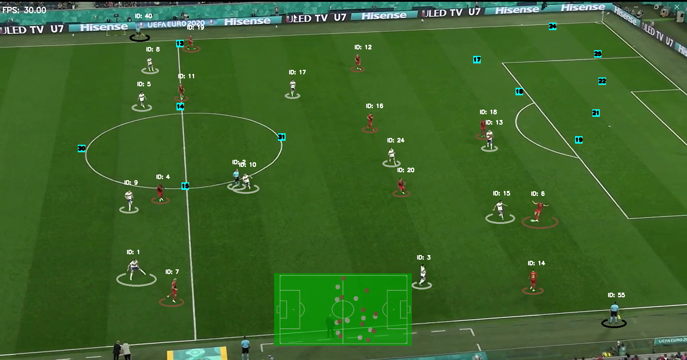
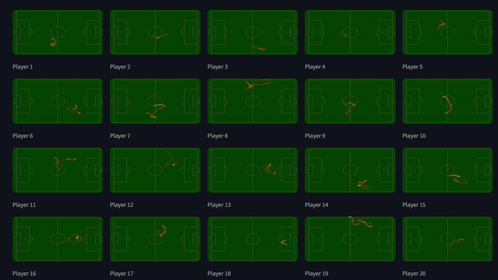

# ⚽ Football Analysis App

This project is a **computer vision-powered football analysis tool** built with **YOLOv11**, **SAHI**, and **Streamlit**.
It detects and tracks players, the ball, and key field elements, creating tactical maps, player heatmaps, and identifying potential offside scenarios.

---

## 🔥 Features

✅ **Player Detection & Tracking**

* Detects and tracks players in real-time using YOLOv11.
* Includes an improved tracking system (`ImprovedPlayers`) to keep IDs consistent.

✅ **Field Keypoint Detection**

* Detects field lines and important pitch keypoints using YOLOv11.

✅ **Ball Detection**

* Uses YOLOv11 + SAHI for robust ball detection.

✅ **Tactical Map Generation**

* Builds a top-down tactical map showing player positions.



✅ **Player Heatmaps**

* Creates heatmaps for individual players based on movement data.


✅ **Offside Detection (Prototype)**

* Highlights players who might be in an offside position.

✅ **Streamlit App**

* Deployable as a web app for easy access and sharing.

---

## 🚀 Upcoming Features

🔹 Improved detection accuracy

🔹 Full implementation of automated offside detection logic

---

## 📂 Project Structure

```
FOOTBALL_ANALYSIS/
├── assigners/                  # Assignments logic (ball-to-player, player-to-team)
│   └── player2teams.py
│
├── data/                       # Datasets and related files
├── input/                      # Input videos/images
├── models/                     # YOLOv11 model weights and configs
├── out/                        # Output results (videos, images, etc.)
├── train/                      # Training scripts and configs
│
├── utils/                      # Utility scripts
│   ├── annotations_utils.py
│   ├── line_detection_utils.py
│   ├── players_utils.py
│   ├── transformation_utils.py
│   └── video_utils.py
│
├── main.py                     # Main entry point for running analysis
├── pyproject.toml              # Poetry project configuration
├── poetry.lock                 # Dependency lock file
├── btrack.yaml                 # Tracker configuration
└── README.md                   # Project documentation
```

---

## 🛠️ Installation

### 1️⃣ Clone the Repository

```bash
git clone https://github.com/Almotasembelah/football_analysis_app.git
cd football_analysis_app
```

### 2️⃣ Set Up Environment

This project uses **Poetry** for dependency management.

```bash
poetry install
```
---

## 🌐 Running the Streamlit App

Launch the Streamlit web app:

```bash
streamlit run main.py
```

Access it at `http://localhost:8501`.

